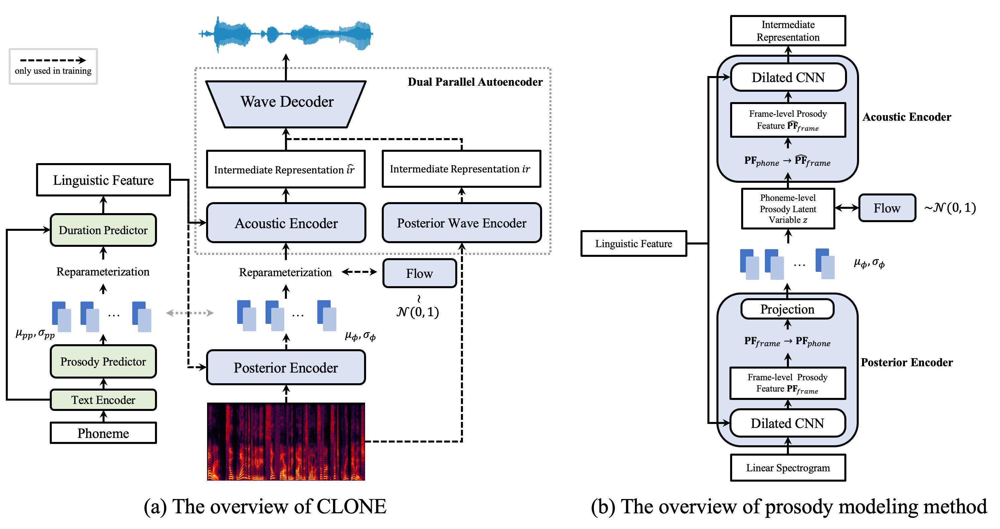

## CLONE: Controllable and Lossless Non-Autoregressive End-to-End Text-to-Speech

### Abstract

Some recent studies have demonstrated the feasibility of single-stage neural text-to-speech, which does not need to generate mel-spectrograms but generates the raw waveforms directly from the text. Single-stage text-to-speech often faces two problems: a) the one-to-many mapping problem due to multiple speech variations and b) insufficiency of high frequency reconstruction due to the lack of supervision of ground-truth acoustic features during training. To solve the a) problem and generate more expressive speech, we propose a novel phoneme-level prosody modeling method based on a variational autoencoder with normalizing flows to model underlying prosodic information in speech. We also use the prosody predictor to support end-to-end expressive speech synthesis. Furthermore, we propose the dual parallel autoencoder to introduce supervision of the ground-truth acoustic features during training to solve the b) problem enabling our model to generate high-quality speech. We compare the synthesis quality with state-of-the-art text-to-speech systems on an internal expressive English dataset. Both qualitative and quantitative evaluations demonstrate the superiority and robustness of our method for lossless speech generation while also showing a strong capability in prosody modeling.

### MOS Sample (Section 4.5.1)

| &nbsp;&nbsp;&nbsp;&nbsp;&nbsp;&nbsp;&nbsp;&nbsp;&nbsp;&nbsp;&nbsp;&nbsp;&nbsp;&nbsp;&nbsp;&nbsp;&nbsp;&nbsp;text&nbsp;&nbsp;&nbsp;&nbsp;&nbsp;&nbsp;&nbsp;&nbsp;&nbsp;&nbsp;&nbsp;&nbsp;&nbsp;&nbsp;&nbsp;&nbsp;&nbsp;&nbsp; | VITS | FastSpeech 2 + TFGAN | Tacotron 2 + TFGAN | CLONE without MBD | CLONE |
| --- | --- | --- | --- | --- | --- |
| He's still so hang up on his dead dog that no one can persuade him to eat. | <audio controls="controls" ><source src="sample/MOS/VITS/1.wav" autoplay/></audio> | <audio controls="controls" ><source src="sample/MOS/FastSpeech 2/1.wav" autoplay/></audio> | <audio controls="controls" ><source src="sample/MOS/Tacotron 2/1.wav" autoplay/></audio> | <audio controls="controls" ><source src="sample/MOS/CLONEwithoutMBD/1.wav" autoplay/></audio> | <audio controls="controls" ><source src="sample/MOS/CLONE/1.wav" autoplay/></audio> |
| Yes, we should try to contact more. | <audio controls="controls" ><source src="sample/MOS/VITS/2.wav" autoplay/></audio> | <audio controls="controls" ><source src="sample/MOS/FastSpeech 2/2.wav" autoplay/></audio> | <audio controls="controls" ><source src="sample/MOS/Tacotron 2/2.wav" autoplay/></audio> | <audio controls="controls" ><source src="sample/MOS/CLONEwithoutMBD/2.wav" autoplay/></audio> | <audio controls="controls" ><source src="sample/MOS/CLONE/2.wav" autoplay/></audio> |
| Oh, we've a lot to learn. | <audio controls="controls" ><source src="sample/MOS/VITS/3.wav" autoplay/></audio> | <audio controls="controls" ><source src="sample/MOS/FastSpeech 2/3.wav" autoplay/></audio> | <audio controls="controls" ><source src="sample/MOS/Tacotron 2/3.wav" autoplay/></audio> | <audio controls="controls" ><source src="sample/MOS/CLONEwithoutMBD/3.wav" autoplay/></audio> | <audio controls="controls" ><source src="sample/MOS/CLONE/3.wav" autoplay/></audio> |
| Do you know the way to Melbourne? | <audio controls="controls" ><source src="sample/MOS/VITS/4.wav" autoplay/></audio> | <audio controls="controls" ><source src="sample/MOS/FastSpeech 2/4.wav" autoplay/></audio> | <audio controls="controls" ><source src="sample/MOS/Tacotron 2/4.wav" autoplay/></audio> | <audio controls="controls" ><source src="sample/MOS/CLONEwithoutMBD/4.wav" autoplay/></audio> | <audio controls="controls" ><source src="sample/MOS/CLONE/4.wav" autoplay/></audio> |
| I like the traditions very much. | <audio controls="controls" ><source src="sample/MOS/VITS/5.wav" autoplay/></audio> | <audio controls="controls" ><source src="sample/MOS/FastSpeech 2/5.wav" autoplay/></audio> | <audio controls="controls" ><source src="sample/MOS/Tacotron 2/5.wav" autoplay/></audio> | <audio controls="controls" ><source src="sample/MOS/CLONEwithoutMBD/5.wav" autoplay/></audio> | <audio controls="controls" ><source src="sample/MOS/CLONE/5.wav" autoplay/></audio> |
| Well, I'll restart the machine and hope for the best. | <audio controls="controls" ><source src="sample/MOS/VITS/6.wav" autoplay/></audio> | <audio controls="controls" ><source src="sample/MOS/FastSpeech 2/6.wav" autoplay/></audio> | <audio controls="controls" ><source src="sample/MOS/Tacotron 2/6.wav" autoplay/></audio> | <audio controls="controls" ><source src="sample/MOS/CLONEwithoutMBD/6.wav" autoplay/></audio> | <audio controls="controls" ><source src="sample/MOS/CLONE/6.wav" autoplay/></audio> |
| He is learning to ride a bicycle. | <audio controls="controls" ><source src="sample/MOS/VITS/7.wav" autoplay/></audio> | <audio controls="controls" ><source src="sample/MOS/FastSpeech 2/7.wav" autoplay/></audio> | <audio controls="controls" ><source src="sample/MOS/Tacotron 2/7.wav" autoplay/></audio> | <audio controls="controls" ><source src="sample/MOS/CLONEwithoutMBD/7.wav" autoplay/></audio> | <audio controls="controls" ><source src="sample/MOS/CLONE/7.wav" autoplay/></audio> |
| I'm not sure about that, we'd better ask the lady there. | <audio controls="controls" ><source src="sample/MOS/VITS/8.wav" autoplay/></audio> | <audio controls="controls" ><source src="sample/MOS/FastSpeech 2/8.wav" autoplay/></audio> | <audio controls="controls" ><source src="sample/MOS/Tacotron 2/8.wav" autoplay/></audio> | <audio controls="controls" ><source src="sample/MOS/CLONEwithoutMBD/8.wav" autoplay/></audio> | <audio controls="controls" ><source src="sample/MOS/CLONE/8.wav" autoplay/></audio> |
| Have you ever received any vaccination? | <audio controls="controls" ><source src="sample/MOS/VITS/9.wav" autoplay/></audio> | <audio controls="controls" ><source src="sample/MOS/FastSpeech 2/9.wav" autoplay/></audio> | <audio controls="controls" ><source src="sample/MOS/Tacotron 2/9.wav" autoplay/></audio> | <audio controls="controls" ><source src="sample/MOS/CLONEwithoutMBD/9.wav" autoplay/></audio> | <audio controls="controls" ><source src="sample/MOS/CLONE/9.wav" autoplay/></audio> |
| Can you tell me where to alter my suits in the downtown? | <audio controls="controls" ><source src="sample/MOS/VITS/10.wav" autoplay/></audio> | <audio controls="controls" ><source src="sample/MOS/FastSpeech 2/10.wav" autoplay/></audio> | <audio controls="controls" ><source src="sample/MOS/Tacotron 2/10.wav" autoplay/></audio> | <audio controls="controls" ><source src="sample/MOS/CLONEwithoutMBD/10.wav" autoplay/></audio> | <audio controls="controls" ><source src="sample/MOS/CLONE/10.wav" autoplay/></audio> |

### CMOS Sample (Section 4.5.1)

| &nbsp;&nbsp;&nbsp;&nbsp;&nbsp;&nbsp;&nbsp;&nbsp;&nbsp;&nbsp;&nbsp;&nbsp;&nbsp;&nbsp;&nbsp;&nbsp;&nbsp;&nbsp;text&nbsp;&nbsp;&nbsp;&nbsp;&nbsp;&nbsp;&nbsp;&nbsp;&nbsp;&nbsp;&nbsp;&nbsp;&nbsp;&nbsp;&nbsp;&nbsp;&nbsp;&nbsp; | 48 kHz Recording | 24 kHz VITS | 24 kHz CLONE | 48 kHz CLONE |
| --- | --- | --- | --- | --- |
| So that's where we should be looking to discover. | <audio controls="controls" ><source src="sample/CMOS/Recording 48k/1.wav" autoplay/></audio> | <audio controls="controls" ><source src="sample/CMOS/VITS 24k/1.wav" autoplay/></audio> | <audio controls="controls" ><source src="sample/CMOS/CLONE 24k/1.wav" autoplay/></audio> | <audio controls="controls" ><source src="sample/CMOS/CLONE 48k/1.wav" autoplay/></audio> |
| Perhaps it is no wonder people are happy to see him. | <audio controls="controls" ><source src="sample/CMOS/Recording 48k/2.wav" autoplay/></audio> | <audio controls="controls" ><source src="sample/CMOS/VITS 24k/2.wav" autoplay/></audio> | <audio controls="controls" ><source src="sample/CMOS/CLONE 24k/2.wav" autoplay/></audio> | <audio controls="controls" ><source src="sample/CMOS/CLONE 48k/2.wav" autoplay/></audio> |
| Maybe you crave a good burger now and again. | <audio controls="controls" ><source src="sample/CMOS/Recording 48k/3.wav" autoplay/></audio> | <audio controls="controls" ><source src="sample/CMOS/VITS 24k/3.wav" autoplay/></audio> | <audio controls="controls" ><source src="sample/CMOS/CLONE 24k/3.wav" autoplay/></audio> | <audio controls="controls" ><source src="sample/CMOS/CLONE 48k/3.wav" autoplay/></audio> |
| We had a taco party at my friend's house, and I invited all these people. | <audio controls="controls" ><source src="sample/CMOS/Recording 48k/4.wav" autoplay/></audio> | <audio controls="controls" ><source src="sample/CMOS/VITS 24k/4.wav" autoplay/></audio> | <audio controls="controls" ><source src="sample/CMOS/CLONE 24k/4.wav" autoplay/></audio> | <audio controls="controls" ><source src="sample/CMOS/CLONE 48k/4.wav" autoplay/></audio> |
| I usually stick to a more natural red shade, but every once in a while I can't resist going blue. | <audio controls="controls" ><source src="sample/CMOS/Recording 48k/5.wav" autoplay/></audio> | <audio controls="controls" ><source src="sample/CMOS/VITS 24k/5.wav" autoplay/></audio> | <audio controls="controls" ><source src="sample/CMOS/CLONE 24k/5.wav" autoplay/></audio> | <audio controls="controls" ><source src="sample/CMOS/CLONE 48k/5.wav" autoplay/></audio> |

### Prosody Variation (Section 4.5.2 - Prosody Variation)

| Sample from -1 | Sample from 1 |
| --- | --- |
| <audio controls="controls" ><source src="sample/Prosody/sample/1_n1.wav" autoplay/></audio> | <audio controls="controls" ><source src="sample/Prosody/sample/1_1.wav" autoplay/></audio> |
| <audio controls="controls" ><source src="sample/Prosody/sample/2_n1.wav" autoplay/></audio> | <audio controls="controls" ><source src="sample/Prosody/sample/2_1.wav" autoplay/></audio> |
| <audio controls="controls" ><source src="sample/Prosody/sample/3_n1.wav" autoplay/></audio> | <audio controls="controls" ><source src="sample/Prosody/sample/3_1.wav" autoplay/></audio> |

### Prosody Transfer (Section 4.5.2 - Prosody Transfer)

| End-to-end Synthesis | Transfer Result | Reference |
| --- | --- | --- |
| <audio controls="controls" ><source src="sample/Prosody/transfer/1_e2e.wav" autoplay/></audio> | <audio controls="controls" ><source src="sample/Prosody/transfer/1.wav" autoplay/></audio> | <audio controls="controls" ><source src="sample/Prosody/transfer/1_ref.wav" autoplay/></audio> |
| <audio controls="controls" ><source src="sample/Prosody/transfer/2_e2e.wav" autoplay/></audio> | <audio controls="controls" ><source src="sample/Prosody/transfer/2.wav" autoplay/></audio> | <audio controls="controls" ><source src="sample/Prosody/transfer/2_ref.wav" autoplay/></audio> |
| <audio controls="controls" ><source src="sample/Prosody/transfer/3_e2e.wav" autoplay/></audio> | <audio controls="controls" ><source src="sample/Prosody/transfer/3.wav" autoplay/></audio> | <audio controls="controls" ><source src="sample/Prosody/transfer/3_ref.wav" autoplay/></audio> |

### Prosody Reconstruction (Section 4.5.2 - Prosody Reconstruction)

| Reconstruction Result | Reference |
| --- | --- |
| <audio controls="controls" ><source src="sample/Prosody/reconstruction/1.wav" autoplay/></audio> | <audio controls="controls" ><source src="sample/Prosody/reconstruction/1_ref.wav" autoplay/></audio> |
| <audio controls="controls" ><source src="sample/Prosody/reconstruction/2.wav" autoplay/></audio> | <audio controls="controls" ><source src="sample/Prosody/reconstruction/2_ref.wav" autoplay/></audio> |
| <audio controls="controls" ><source src="sample/Prosody/reconstruction/3.wav" autoplay/></audio> | <audio controls="controls" ><source src="sample/Prosody/reconstruction/3_ref.wav" autoplay/></audio> |

### Prosody Predictor Transfer

By replacing the speaker id of the prosody predictor, we can use the prosody of different speaker to synthesize the sound of the same timbre.

| Speaker A | Speaker A with Prosody Predictor of Speaker B | Speaker B |
| --- | --- | --- |
| <audio controls="controls" ><source src="sample/Prosody/pp/1.wav" autoplay/></audio> | <audio controls="controls" ><source src="sample/Prosody/pp/1_trans.wav" autoplay/></audio> | <audio controls="controls" ><source src="sample/Prosody/pp/1_ori.wav" autoplay/></audio> |
| <audio controls="controls" ><source src="sample/Prosody/pp/2.wav" autoplay/></audio> | <audio controls="controls" ><source src="sample/Prosody/pp/2_trans.wav" autoplay/></audio> | <audio controls="controls" ><source src="sample/Prosody/pp/2_ori.wav" autoplay/></audio> |
| <audio controls="controls" ><source src="sample/Prosody/pp/3.wav" autoplay/></audio> | <audio controls="controls" ><source src="sample/Prosody/pp/3_trans.wav" autoplay/></audio> | <audio controls="controls" ><source src="sample/Prosody/pp/3_ori.wav" autoplay/></audio> |
